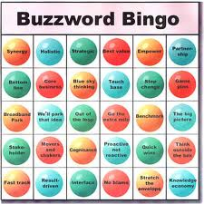

!SLIDE black-slide center top
# Rails for Newbs #

* David Jones
* Indy.rb - Jan 12, 2011

!SLIDE title-slide
# What is Ruby on Rails? #

!SLIDE center
## An opinionated full-stack framework for developing database-backed, web-based applications with the Model View Controller paradigm against a REST-based interface; with a focus on convention over configuration. ##

!SLIDE title-slide center
# What does all that mean? #

!SLIDE bullets incremental
## It means that if you learn and stick to the "Rails" way, hard, yet inconsequential decisions are already made for you. ##

* folder structure > generated
* where goes code > use MVC
* routing decisions > use REST
* database changes > migrations

!SLIDE commandline incremental
# Generators #
### Code generation is one of the simple tricks Rails uses to get things wired up quickly ###
	$ rails new sports_app
	create
	create  README
	create  Rakefile
	create  config.ru
	create  .gitignore
	create  Gemfile
	create  app
	create  app/controllers/application_controller.rb
	create  app/helpers/application_helper.rb
	create  app/mailers
	create  app/models
	create  app/views/layouts/application.html.erb
	.....etc

!SLIDE commandline incremental
# Generators #
	$ cd sports_app/
	$ ls
	Gemfile
	README
	Rakefile
	app
	config
	config.ru
	db
	doc
	lib
	log
	public
	script
	test
	tmp
	vendor

!SLIDE commandline incremental
# A place for everything #
	$ ls app/
	controllers
	helpers
	mailers
	models
	views

!SLIDE commandline incremental
# And everything has a place #
	$ ls public/
	404.html
	422.html
	500.html
	favicon.ico
	images
	index.html
	javascripts
	robots.txt
	stylesheets

!SLIDE commandline incremental
# Dependency management #
	$ cat Gemfile
	gem 'sqlite3-ruby', :require => 'sqlite3'
	gem 'ruby-debug'
	group :development, :test do
	  gem 'hirb'
	  gem 'awesome_print', :require => 'ap'
	end

	$ bundle install
	Fetching source index for http://rubygems.org/
	Using rake (0.8.7)
	Using abstract (1.0.0)
	Using activesupport (3.0.3)
	....
	Using railties (3.0.3)
	Using rails (3.0.3)
	Installing sqlite3-ruby (1.3.2) with native extensions
	Your bundle is complete! Use `bundle show [gemname]`
	to see where a bundled gem is installed.

!SLIDE commandline incremental
# More code generation #
	$ rails generate scaffold sport name:string
	invoke  active_record
	create    db/migrate/20110112201103_create_sports.rb
	create    app/models/sport.rb
	 route  resources :sports
	invoke  scaffold_controller
	create    app/controllers/sports_controller.rb
	invoke    erb
	create      app/views/sports
	create      app/views/sports/index.html.erb
	create      app/views/sports/edit.html.erb
	create      app/views/sports/show.html.erb
	create      app/views/sports/new.html.erb
	create      app/views/sports/_form.html.erb
	invoke    helper
	create      app/helpers/sports_helper.rb
	invoke      test_unit
	create        test/unit/helpers/sports_helper_test.rb
	invoke  stylesheets
	create    public/stylesheets/scaffold.css

!SLIDE
	@@@ ruby
	# db/20110112201103_create_sports.rb
	class CreateSports < ActiveRecord::Migration

      def self.up
        create_table :sports do |t|
          t.string :name
          t.timestamps
        end
      end

      def self.down
        drop_table :sports
      end

	end

!SLIDE commandline incremental
	$ rake db:migrate
	(in /Users/djones/code/indyrb/sports_app)
	==  CreateSports: migrating ===================================================
	-- create_table(:sports)
	   -> 0.0013s
	==  CreateSports: migrated (0.0013s) ==========================================

!SLIDE title-slide
# MVC - The model #

!SLIDE
## The model is the brain of the app, it is the interface to our database and where you should keep your business logic ##

!SLIDE
## $ app/models/sport.rb ##
	@@@ ruby
	class Sport < ActiveRecord::Base
	  # here be magic
	end

!SLIDE
## What magic? ##
### Under the covers, AR::Base defines getters and setters, save, destroy, callbacks and more ###
	@@@ ruby
	s = Sport.new(:name => 'Football')
	  #=> #<Sport id: nil, name: "Football">
	s.save
	  #=> true
	s.name
	  #=> "Football"

!SLIDE
## Where's the SQL? ##
### ActiveRecord provides an ORM to let you compose queries in code. ###

	@@@ ruby
	Sport.create(:name => 'Football')
	Sport.create(:name => 'Baseball')
	Sport.create(:name => 'Hockey')

	Sport.where('name LIKE ?', '%ball')
	  # => [
	        #<Sport id: 1, name: "Football">,
	        #<Sport id: 1, name: "Baseball">
	       ]

!SLIDE
## MVC - The Controller ##
### The router looks at the incoming request and determines where to send it, the controller handles the logic of flowing from page to page and connecting the model to the view ###

	@@@ ruby
	# app/controllers/sports_controller.rb
	def index
	  @sports = Sport.all
	end

	def show
	  @sport = Sport.find(params[:id])
	end

	def new
	  @sport = Sport.new
	end

	def create
	  @sport = Sport.new(params[:sport])
	  if @sport.save
	    redirect_to(@sport, :notice => 'Sport was successfully created.')
	  else
	    render :action => :new
	  end
	end

!SLIDE
# REST #

!SLIDE bullets
## REST is short for REpresentational State Transfer ##
### but is just a fine way to organize and wire up routes based on "things", or "resources" ###

* GET
* POST
* PUT
* DELETE

!SLIDE bullets smaller incremental
# REST #
### Maps HTTP verbs cleanly to SQL operations ###

* GET == SELECT
* POST == INSERT
* PUT == UPDATE
* DELETE == DELETE

!SLIDE
### Browsers don't support all the HTTP Verbs yet, so rails adds a \_method input to all forms to fake it. This is like in PHP code, checking for $\_POST and doing something differently than when it is a $\_GET ###

	@@@ ruby
	# GET /sports
	route: 'sports#index'
	query: Sport.all

	# POST /sports
	route: 'sports#create'
	query: Sport.create(params[:sport])

	# GET /sports/1
	route: 'sports#show'
	query: Sport.find(params[:id])

	# DELETE /sports/1
	route: 'sports#destroy'
	query: Sport.find(params[:id]).destroy

!SLIDE title-slide
# MVC - The View #

!SLIDE
## app/views/sports/index.html.erb ##

	@@@ html
	<h1>Listing sports</h1>

	<table>
	  <tr>
	    <th>Name</th>
	    <th></th>
	    <th></th>
	    <th></th>
	  </tr>

	  <% @sports.each do |sport| %>
	    <tr>
	      <td><%= sport.name %></td>
	      <td><%= link_to 'Show', sport %></td>
	      <td><%= link_to 'Edit', edit_sport_path(sport) %></td>
	      <td><%= link_to 'Destroy', sport,
	                      :confirm => 'Are you sure?',
	                      :method => :delete %></td>
	    </tr>
	  <% end %>
	</table>
	 

	<%= link_to 'New Sport', new_sport_path %>

!SLIDE smbullets incremental
# So, what's going on here? #

* Browser goes to /sports
* Router looks for sports resource (and finds it)
* Router sends request to sports_controller.rb, index action
* Query for all Sports in database saved to class variable
* class variable handed to template
* Template views/sports/index.html.erb rendered

!SLIDE commandline incremental
# Let's add another resource #
	$ rails generate scaffold team sport:references name:string
	invoke  active_record
	create    db/migrate/20110112221618_create_teams.rb
	create    app/models/team.rb
	invoke    test_unit
	create      test/unit/team_test.rb
	create      test/fixtures/teams.yml
	 route  resources :teams
	invoke  scaffold_controller
	create    app/controllers/teams_controller.rb

!SLIDE
# Model Relationships #
	@@@ ruby
	# db/migrate/*_create_teams.rb
	class CreateTeams < ActiveRecord::Migration

	  def self.up
	    create_table :teams do |t|
	      t.references :sport
	      t.string :name
	      t.timestamps
	    end
	  end

	  def self.down
	    drop_table :teams
	  end

	end

!SLIDE commandline incremental

	$ rake db:migrate
	(in /Users/djones/code/indyrb/sports_app)
	==  CreateTeams: migrating ====================================================
	-- create_table(:teams)
	   -> 0.0013s
	==  CreateTeams: migrated (0.0014s) ===========================================

!SLIDE
# Model Relationships #

!SLIDE
## See, how has_many basically defines a method on sports named teams, that queries for the teams associated with the sport by its sport\_id column ##

	@@@ ruby
	# app/models/sport.rb
	class Sport < ActiveRecord::Base
	  has_many :teams
	end

	# app/models/team.rb
	class Team < ActiveRecord::Base
	  belongs_to :sport
	end

	football = Sport.where(:name => 'Football').first
	football.teams #=> []

	football.teams.create(:name => 'Colts')
	football.teams #=> [
	                     #<team id:1 name:'Colts' sport_id:1>
	                   ]

!SLIDE commandline incremental
# Lets make it prettier #
	$ echo "gem 'web_app_theme' >> Gemfile" && bundle
	$ rails generate web_app_theme:theme
	    conflict  app/views/layouts/application.html.erb
	Overwrite app/views/layouts/application.html.erb? (enter "h" for help) [Ynaqdh]
	 force  app/views/layouts/application.html.erb
	create  public/stylesheets/web-app-theme/base.css
	create  public/stylesheets/web-app-theme/override.css
	create  public/stylesheets/web-app-theme/themes/default
	create  public/stylesheets/web-app-theme/themes/default/images/arrow.png
	create  public/stylesheets/web-app-theme/themes/default/style.css
	create  public/images/web-app-theme
	create  public/images/web-app-theme/avatar.png
	create  public/images/web-app-theme/icons/application_edit.png
	create  public/images/web-app-theme/icons/cross.png
	create  public/images/web-app-theme/icons/key.png
	create  public/images/web-app-theme/icons/tick.pn

!SLIDE
## Let's add teams list to sport page ##
### Before: ###
	@@@ html
	# app/views/sports/show.html.erb
	

	  <b>Name:</b>
	  <%= @sport.name %>
	

	<%= link_to 'Edit', edit_sport_path(@sport) %> |
	<%= link_to 'Back', sports_path %>

!SLIDE
## Let's add teams list to sport page ##
### After: ###
	@@@ html
	# app/views/sports/show.html.erb
	

	  <b>Name:</b>
	  <%= @sport.name %>
	  <ul>
	    <% @sport.teams.each do |team| %>
	       <li><%= team.name %></li>
	    <% end %>
	  </ul>
	

	<%= link_to 'Edit', edit_sport_path(@sport) %> |
	<%= link_to 'Back', sports_path %>

!SLIDE top center
# Thank you #
### David Jones

### [unixmonkey.net](http://unixmonkey.net)
### [twitter.com/unixmonkey](http://twitter.com/unixmonkey)
### [github.com/unixmonkey](http://github.com/unixmonkey)
